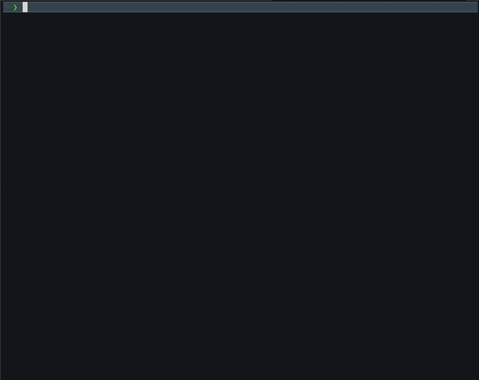

<!--
MIT License

Copyright (c) 2024 Jason Hwang

Permission is hereby granted, free of charge, to any person obtaining a copy
of this software and associated documentation files (the "Software"), to deal
in the Software without restriction, including without limitation the rights
to use, copy, modify, merge, publish, distribute, sublicense, and/or sell
copies of the Software, and to permit persons to whom the Software is
furnished to do so, subject to the following conditions:

The above copyright notice and this permission notice shall be included in all
copies or substantial portions of the Software.

THE SOFTWARE IS PROVIDED "AS IS", WITHOUT WARRANTY OF ANY KIND, EXPRESS OR
IMPLIED, INCLUDING BUT NOT LIMITED TO THE WARRANTIES OF MERCHANTABILITY,
FITNESS FOR A PARTICULAR PURPOSE AND NONINFRINGEMENT. IN NO EVENT SHALL THE
AUTHORS OR COPYRIGHT HOLDERS BE LIABLE FOR ANY CLAIM, DAMAGES OR OTHER
LIABILITY, WHETHER IN AN ACTION OF CONTRACT, TORT OR OTHERWISE, ARISING FROM,
OUT OF OR IN CONNECTION WITH THE SOFTWARE OR THE USE OR OTHER DEALINGS IN THE
SOFTWARE.

---

Original Code for README.md:

MIT License

Copyright (c) 2019-2024 Othneil Drew

Permission is hereby granted, free of charge, to any person obtaining a copy
of this software and associated documentation files (the "Software"), to deal
in the Software without restriction, including without limitation the rights
to use, copy, modify, merge, publish, distribute, sublicense, and/or sell
copies of the Software, and to permit persons to whom the Software is
furnished to do so, subject to the following conditions:

The above copyright notice and this permission notice shall be included in all
copies or substantial portions of the Software.

THE SOFTWARE IS PROVIDED "AS IS", WITHOUT WARRANTY OF ANY KIND, EXPRESS OR
IMPLIED, INCLUDING BUT NOT LIMITED TO THE WARRANTIES OF MERCHANTABILITY,
FITNESS FOR A PARTICULAR PURPOSE AND NONINFRINGEMENT. IN NO EVENT SHALL THE
AUTHORS OR COPYRIGHT HOLDERS BE LIABLE FOR ANY CLAIM, DAMAGES OR OTHER
LIABILITY, WHETHER IN AN ACTION OF CONTRACT, TORT OR OTHERWISE, ARISING FROM,
OUT OF OR IN CONNECTION WITH THE SOFTWARE OR THE USE OR OTHER DEALINGS IN THE
SOFTWARE.
-->

<!-- PROJECT LOGO -->
<br />
<div align="center">
  <a href="https://github.com/dotjasonhwang/treasures">
    
    <h1 align="center">treasures</h1>
  </a>

  <h3 align="center">where moths and vermin do not destroy, and where thieves do not break in and steal</h3>
</div>

<!-- TABLE OF CONTENTS -->
<details>
  <summary>Table of Contents</summary>
  <ol>
    <li><a href="#about">About</a></li>
    <li><a href="#setup">Getting Started</a></li>
    <li><a href="#usage">Usage</a></li>
    <li><a href="#built-with">Built With</a></li>
    <li><a href="#contributing">Contributing</a></li>
    <li><a href="#license">License</a></li>
    <li><a href="#contact">Contact</a></li>
    <li><a href="#acknowledgments">Acknowledgments</a></li>
  </ol>
</details>

## About

The year is 2023. I am working on my budgeting game. Commercial applications are a bit too centralized and un-customizable for a software nerd like myself. I am also growing in my relationship with money, and I come across the [The Finish Line Pledge](https://www.finishlinepledge.com). Combining these two threads, **Treasures** is born.

**Treasures** takes transaction sheets and consolidates a monthly budget breakdown, and the bottom line metric is based on your personal "financial finish line". The intent was to use the finish line metric to direct the focus of the budgeting from storing treasures on earth to storing them in heaven.

The Financial Finish Line is a monthly number that the Finish Line Pledge computes using household size, target percentile, and a variety of data sources. See [The Finish Line Pledge](https://www.finishlinepledge.com) for a full breakdown as well as a wealth of valuable content and resources.

Matthew 6:19-21:
“Do not store up for yourselves treasures on earth, where moths and vermin destroy, and where thieves break in and steal. But store up for yourselves treasures in heaven, where moths and vermin do not destroy, and where thieves do not break in and steal. For where your treasure is, there your heart will be also."

**Disclaimer**: This is a personal project that I have tested for my own use case, and I do not guarantee correct results. Please feel free to contact me if you have any questions.



## Getting Started

1. Make sure your environment is set up to run Python3
2. `pip install -r requirements.txt`

## Usage

```
usage: driver.py [-h] -n HOUSEHOLD_SIZE -p PERCENTILE -f FILE_DIR -c CONFIG_FILE

Treasures

options:
  -h, --help            show this help message and exit
  -n HOUSEHOLD_SIZE, --household_size HOUSEHOLD_SIZE
                        Household size
  -p PERCENTILE, --percentile PERCENTILE
                        Target percentile of income
  -f FILE_DIR, --file_dir FILE_DIR
                        Location of the bank transactions
  -c CONFIG_FILE, --config_file CONFIG_FILE
                        Location of the config file, where processors are defined
```

Example:
`python3 src/driver.py -n 2 -p 50 -f my_transactions_folder/2024/01/01/ -c data/my_config_file.json`

## Built With

[![Python][python-shield]][python-url]

## Contributing

Thank you for your interest in contributing to this project. Open source projects are a beautiful picture of collaboration and generosity. Please raise items for discussion using the links below, via a pull request, or by email.

[Request Feature][feature-request-url]<br>
[Report Bug][bug-report-url]

<!-- LICENSE -->

## License

[![License][license-shield]][license-url]

## Contact

Jason Hwang<br>
[hello@dotjasonhwang.com](mailto:hello@dotjasonhwang.com)

## Acknowledgments

- [The Finish Line Pledge](https://www.finishlinepledge.com)
  - For the encouragement to walk a more meaningful financial road
  - For the original source code for the "line" calculation
- [othneildrew/Best-README-Template][readme-template-url]
  - For the README template
- The first cohort of Breath
  - For your genuine and life-giving energy that one special weekend

<!-- MARKDOWN LINKS -->
<!-- https://www.markdownguide.org/basic-syntax/#reference-style-links -->

<!-- repo -->

[feature-request-url]: https://github.com/dotjasonhwang/treasures/issues/new?labels=enhancement&template=feature-request---.md
[bug-report-url]: https://github.com/dotjasonhwang/treasures/issues/new?labels=bug&template=bug-report---.md

<!-- about -->

[product-screenshot]: readme-assets/example.png

<!-- built_with -->

[python-shield]: https://img.shields.io/badge/python-3670A0?style=for-the-badge&logo=python&logoColor=ffdd54
[python-url]: https://python.org/

<!-- license -->

[license-shield]: https://img.shields.io/github/license/dotjasonhwang/treasures.svg?style=for-the-badge
[license-url]: https://github.com/dotjasonhwang/treasures/blob/master/LICENSE.txt

<!-- acknowledgements -->

[readme-template-url]: https://github.com/othneildrew/Best-README-Template
